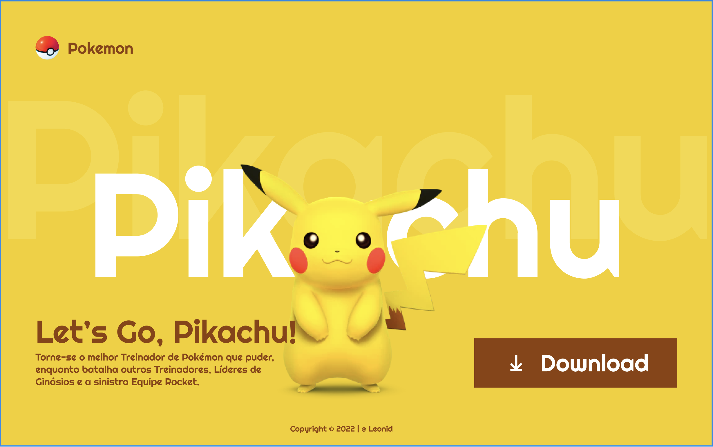

#  Pikachu Page - Projeto de Estudo SENAI


##  Descrição

Este projeto foi desenvolvido durante o curso técnico em Desenvolvimento de Sistemas no SENAI, com o objetivo de praticar a criação de interfaces modernas e responsivas utilizando HTML5 e CSS3.

A página apresenta um design inspirado no universo Pokémon, com foco no personagem Pikachu, demonstrando o uso de variáveis CSS, responsividade e posicionamento absoluto para efeitos visuais dinâmicos.


##  Estrutura do Projeto

```
pikachu-page/
├── css/               # Arquivos de estilo
│   ├── reset.css      # Reset de estilos para uniformizar o layout
│   └── style.css      # Estilos principais do projeto
├── imgs/              # Imagens utilizadas na página
│   ├── pikachu (1).png
│   └── poke-bola.png
└── index.html         # Página principal
```

##  Funcionalidades

- **Design Temático:** Interface baseada no universo Pokémon
- **Texto em Camadas:** Nome “Pikachu” com efeito de sombra de fundo
- **Layout Responsivo:** Ajusta-se automaticamente a tablets e celulares
- **Botão de Download:** Simula a ação de baixar o jogo
- **Tipografia Personalizada:** Uso da fonte Roboto do Google Fonts
- **Organização Visual:** Hierarquia clara entre título, descrição e imagem
- **Centralização Precisa:** Uso de position: absolute e transform

##  Tecnologias Utilizadas

- **HTML5:** Estrutura do conteúdo da página
- **CSS3:** Estilização, responsividade e efeitos visuais
- **Google Fonts (Roboto):** Tipografia moderna e legível

##  Como Executar

1. Clone o repositório
```bash
git clone https://github.com/Cosme-CR/Pikachu
```

2. Navegue até a pasta do projeto
```bash
cd Pikachu
```

3. Abra o arquivo index.html em seu navegador
```bash
open index.html
```

##  Melhorias Implementadas

- Layout com variáveis CSS globais
- Centralização absoluta de elementos
- Responsividade aprimorada para diferentes resoluções
- Tipografia personalizada via Google Fonts
- Paleta de cores temática (amarelo e marrom)


###  Agradecimentos

- Desenvolvido por Cosme Ribeiro
- Curso: Desenvolvimento de Sistemas - SENAI
- Imagens: Pokémon Company
- Fonte: Google Fonts

